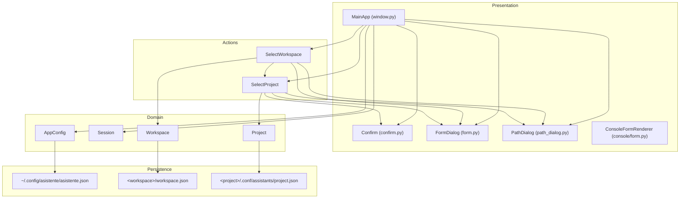
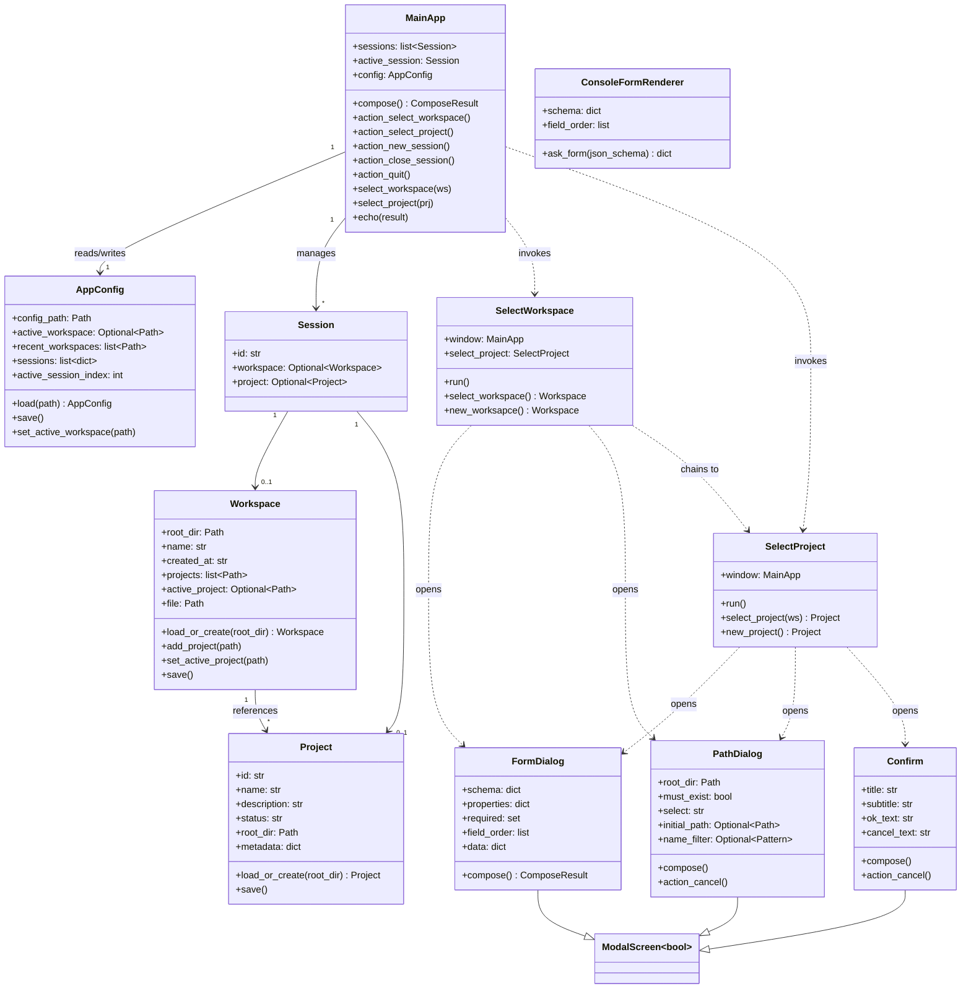
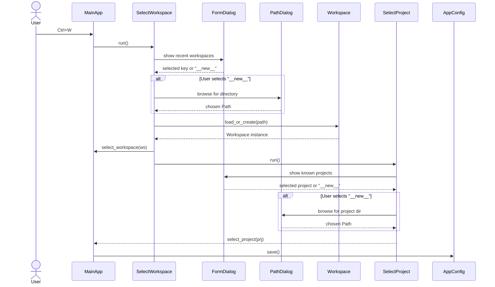
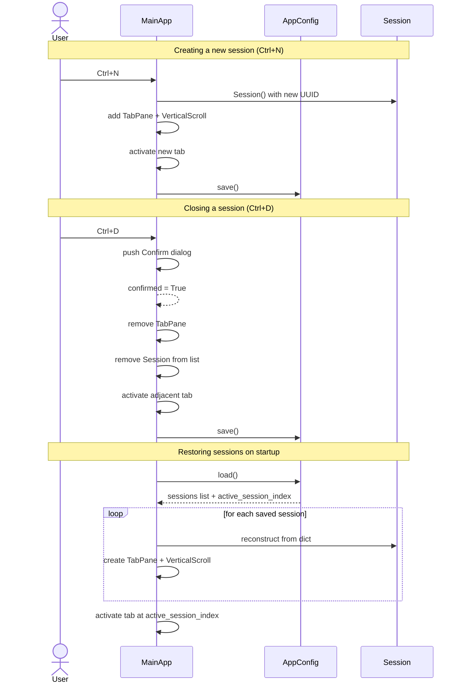

# Architecture Overview

## 1. Introduction

**Asistente** is a Python TUI (Text User Interface) application built on
[Textual](https://textual.textualize.io/). It provides a tabbed, multi-session
chat interface where each session is scoped to a **workspace** and an optional
**project**. The application persists its state entirely through JSON files -- no
database is required.

The codebase follows a layered architecture that separates presentation,
coordination logic (actions), domain models, and persistence concerns.

---

## 2. Layer Diagram

---

## 3. Class Diagram

---

## 4. Sequence Diagram -- Workspace Selection Flow

---

## 5. Sequence Diagram -- Session Lifecycle

---

## 6. Persistence Model

The application stores all of its state in three JSON files. No external
database is required.

### 6.1 Application Configuration

| Property      | Value                                      |
|---------------|--------------------------------------------|
| **Location**  | `~/.config/asistente/asistente.json`       |
| **Managed by**| `AppConfig`                                |
| **Contains**  | Active workspace path, list of up to 10 recent workspaces, serialised session list, active session index |

### 6.2 Workspace Manifest

| Property      | Value                                      |
|---------------|--------------------------------------------|
| **Location**  | `<workspace_root>/workspace.json`          |
| **Managed by**| `Workspace`                                |
| **Contains**  | Workspace name, creation timestamp, list of project paths, currently active project path |

### 6.3 Project Manifest

| Property      | Value                                      |
|---------------|--------------------------------------------|
| **Location**  | `<project_root>/.conf/assistants/project.json` |
| **Managed by**| `Project`                                  |
| **Contains**  | Project UUID, name, description, status, root directory, arbitrary metadata dict |

---

## 7. Design Decisions

| Decision | Rationale |
|----------|-----------|
| **Textual for the TUI** | Provides a modern, CSS-styled widget toolkit with async support and built-in modal screens, which maps naturally to the tabbed chat interface. |
| **Dataclasses for domain models** | Keeps the domain layer lightweight and free of framework dependencies. Serialisation to/from JSON is straightforward. |
| **JSON file persistence** | Eliminates external dependencies (no SQLite, no ORM). Each concern writes its own file in a predictable location, making manual inspection and backup trivial. |
| **UUID-4 identifiers** | Guarantees globally unique session and project IDs without coordination. |
| **ModalScreen pattern** | Textual's `ModalScreen` with a typed return value (`ModalScreen[bool]`, `ModalScreen[dict]`, `ModalScreen[Path]`) gives a clean request/response contract for dialogs. |
| **JSON Schema for forms** | A single schema definition drives both the Textual `FormDialog` and the fallback `ConsoleFormRenderer`, ensuring consistent validation across UIs. |
| **Action classes** | Encapsulating multi-step flows (workspace selection, project selection) into dedicated action classes keeps `MainApp` thin and each flow independently testable. |
| **Workspace to Project chaining** | Selecting a workspace automatically chains into project selection, reducing the number of manual steps for the user. |
| **Recent workspaces cap (10)** | Prevents the list from growing unbounded while still providing quick access to frequently used workspaces. |
| **Separation of console and textual renderers** | Allows the form logic to be reused in non-TUI contexts (scripts, CI pipelines) via `ConsoleFormRenderer` backed by `prompt_toolkit`. |
